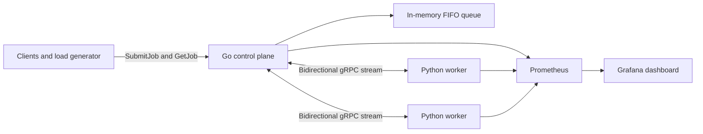

# Apollo distributed job scheduler

Apollo is a small distributed scheduler built to make failure and performance behavior visible. A Go control plane assigns typed jobs over gRPC to concurrent Python workers. Workers run in Docker Compose or Kubernetes, and Prometheus plus Grafana expose what the scheduler is doing.

The current implementation is intentionally single-controller and in-memory. It demonstrates scheduling, retries, worker loss, and horizontal worker scaling without pretending to offer durable production semantics.

## Measured results

The latest Kind run on an Apple Silicon Mac measured:

| Scenario | Median throughput | Scheduling latency p95 |
| --- | ---: | ---: |
| One worker, four slots | 203.6 jobs/sec | 1575.3 ms |
| Four workers, sixteen slots | 668.2 jobs/sec | 421.3 ms |

Four workers improved median throughput by 228.1% for the recorded workload. In a matched worker-deletion test, jobs with one allowed attempt produced four terminal failures; three attempts with reassignment produced none. These are local benchmark results, not universal capacity claims. The [benchmark report](docs/benchmarks/latest.md) records the method and links to checked-in raw JSON.

## How it works



Each worker opens one long-lived stream, advertises its capacity, and sends a heartbeat every second. The scheduler chooses the healthy worker with the lowest active-slot ratio. Every assignment has a unique attempt ID, so a late result from a disconnected worker cannot overwrite the current attempt.

Apollo supports three safe demo tasks:

| Task | Input | Purpose |
| --- | --- | --- |
| `ADD` | Two floating-point operands | Fast correctness and throughput checks |
| `SLEEP` | Duration from 1 ms to 300 seconds | Deterministic concurrency and failure tests |
| `CPU_BURN` | Duration from 1 ms to 300 seconds | CPU saturation tests |

Workers never execute arbitrary Python or shell commands.

## Run with Docker Compose

Requirements are Docker and Docker Compose.

```bash
docker compose up --build --detach --scale worker=4
```

The main endpoints are:

- gRPC control plane: `localhost:50051`
- control-plane metrics: [localhost:9090/metrics](http://localhost:9090/metrics)
- Prometheus: [localhost:9091](http://localhost:9091)
- Grafana: [localhost:3000](http://localhost:3000), anonymous read access is enabled

Submit a ten-second stream of ADD jobs:

```bash
cd control-plane
go run ./cmd/loadgen -rate 100 -duration 10s -task-mix add=100,sleep=0,cpu=0
```

Stop the stack with `docker compose down`.

## Run on Kind

Requirements are Docker, Kind, `kubectl`, Go, and Python 3.12.

```bash
./scripts/kind-up.sh
./scripts/kind-smoke.sh
```

The setup script creates the `apollo` cluster, builds and loads local images, applies the Kustomize package, and waits for the control plane, four workers, Prometheus, and Grafana. Use `kubectl -n apollo port-forward service/grafana 3000:3000` to open the dashboard.

Delete and replace one worker with `./scripts/kill-worker.sh`. Remove the cluster with `./scripts/kind-down.sh`.

## Delivery and failure behavior

- Jobs use at-least-once delivery. A task may execute more than once after a lost connection.
- The default attempt limit is three, including the initial assignment. Clients may choose one through ten attempts.
- Retry delay grows from 100 ms and is capped by the fifth backoff step. Worker loss is requeued immediately.
- Workers heartbeat every second. The control plane removes a worker after three seconds without a heartbeat.
- Results must match the active job and attempt IDs. Stale results receive `FAILED_PRECONDITION`.
- A control-plane restart loses queued, running, and completed job records. The Kubernetes deployment therefore has one control-plane replica.

See [the architecture notes](docs/architecture.md) for state transitions and known limits.

## Observability

The control plane exports queue depth, running jobs, worker and slot counts, submitted and completed jobs, retry and reassignment counters, execution duration, and scheduling latency. Workers export active jobs, configured capacity, task outcomes, execution duration, process CPU, and resident memory.

Grafana provisions the `Apollo scheduler` dashboard from the repository. Prometheus discovers every worker replica through Docker DNS or Kubernetes pod annotations.

## Development and verification

Create a Python 3.12 environment and install `worker/requirements-dev.txt`, then run:

```bash
make lint-proto
make generate
cd control-plane && go test -race ./... && go vet ./...
cd ..
ruff check worker bench scripts/compose-smoke.py
mypy worker bench/summarize.py scripts/compose-smoke.py
pytest -q
```

`make generate` runs Buf and pinned remote plugins inside a pinned container. Generated Go and Python files stay in Git so consumers do not need `protoc`.

Run the full measured benchmark against an existing Apollo Kind cluster with `./bench/run-kind.sh`. It performs warmups, five trials per worker count, matched pod-deletion tests, and rewrites the report from raw JSON.

## Known limits

Apollo has no durable store, authentication, TLS, tenant isolation, cancellation API, or controller election. Worker task functions must tolerate duplicate execution. PostgreSQL or Redis persistence and a leased multi-controller design are the next steps if durable recovery becomes a requirement.
