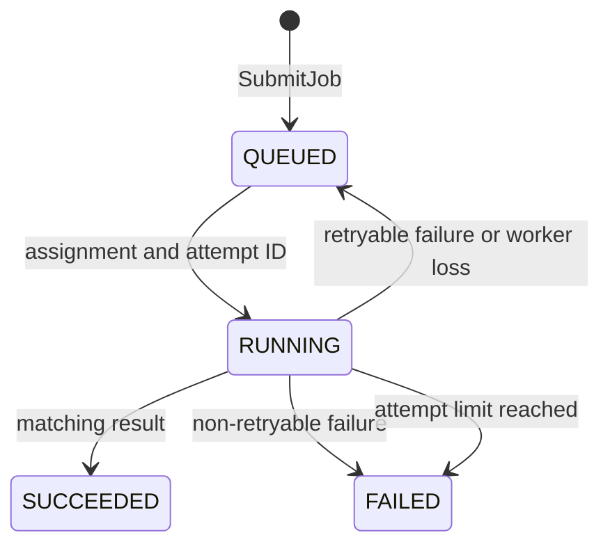

# Architecture and execution model

## Control-plane state

The Go control plane owns four in-memory structures behind one mutex:

- Job records indexed by job ID.
- A FIFO queue containing jobs that are ready now or after retry backoff.
- Connected workers indexed by worker ID.
- Active attempt IDs stored under the worker that received them.

The queue is FIFO among ready jobs. A delayed retry does not block a later ready job. Worker selection compares active slots divided by advertised capacity and breaks ties by worker ID, which keeps tests deterministic.

State is not replicated or persisted. Running more than one control-plane replica would split the queue and worker registry, so every supplied deployment fixes the replica count at one.

## Job lifecycle

The scheduler increments the attempt count when it assigns a job. The default limit of three therefore means one initial attempt and at most two retries. Explicit task validation failures are not retryable. Exceptions raised during execution are retryable unless the Python worker classifies them as input errors.

At-least-once delivery is unavoidable when the scheduler loses a worker after assignment. The worker might still finish after the scheduler has reassigned the job. Apollo rejects that late result because its attempt ID is no longer active. This protects job state but cannot undo side effects performed by the task, so real task handlers would need idempotency keys or transactional writes.

## Worker connection

The worker initiates a bidirectional gRPC stream. Its first request contains a stable worker ID and capacity. Later requests carry heartbeats, results, or failures; responses carry assignments.

The Python worker uses a bounded thread pool whose size matches its advertised capacity. Heartbeats use a monotonic deadline independent of result traffic. If the stream ends, the worker abandons the old connection queue, backs off from 250 ms to 10 seconds, and reconnects with the same ID.

The control plane checks heartbeat age every 500 ms. After three seconds it closes the worker assignment channel, requeues eligible active jobs, and makes their old attempt IDs stale.

## Metrics cost

Scheduler instrumentation uses an observer interface. Prometheus code does not enter the scheduling package or its tests. Queue and running gauges derive from queue length and active worker slots, so metric update cost does not grow with completed job history. The benchmark suite caught and removed an earlier implementation that scanned every historical job on each state change.

## Deployment boundaries

Docker Compose uses service DNS to find worker metric endpoints. Kubernetes uses namespace-scoped pod discovery and scrape annotations so Prometheus receives one target per replica. The Prometheus Role can only read pods, services, and endpoints in the `apollo` namespace.

Containers use plaintext gRPC on the private deployment network. Production use would require TLS, client identity, authorization, job payload limits, durable job state, and controller election.
